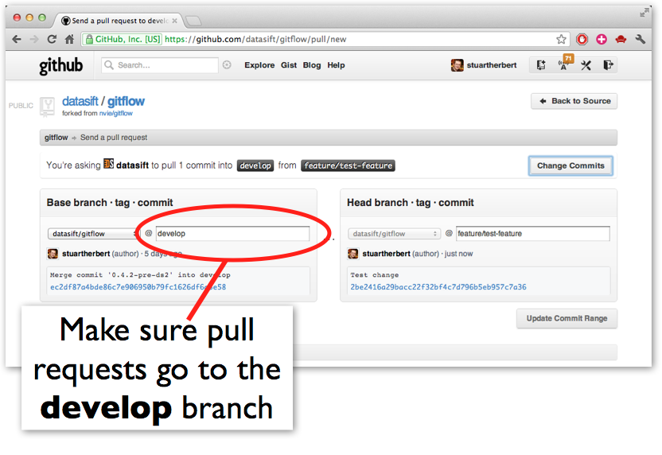
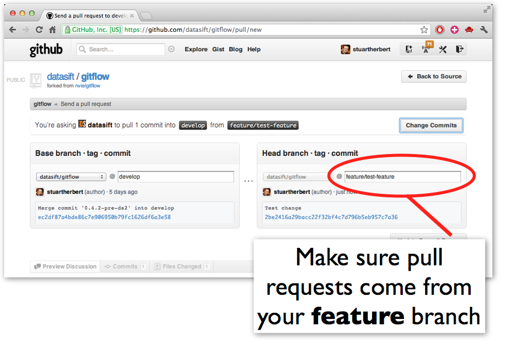

# Using GitFlow With GitHub #

## Introduction ##

This is our recommended workflow for using:

* [The GitFlow branching model](http://nvie.com/posts/a-successful-git-branching-model/)
* \+ [HubFlow, our fork of the GitFlow tools](https://github.com/datasift/gitflow)
* \+ [GitHub](https://github.com)

together.  We're assuming you've already looked at stock GitFlow, and understand the concepts of __feature branches__, __release branches__, __hotfixes__, __releases__ and the __develop branch__.  If you haven't, please first read:

* [GitFlow](http://nvie.com/posts/a-successful-git-branching-model/) (Vincent Driessen's original blog post)
* [Introducing GitFlow](http://datasift.github.com/gitflow/IntroducingGitFlow.html) (our own introduction to GitFlow)

Please note:

* At this time, this workflow is designed for developers who belong to the same GitHub organisation.  Although you are welcome to use it for opensource projects, it is designed for companies like [DataSift](http://datasift.com) who are using private repos on GitHub.
* I'll release an alternative version, that supports GitHub's fork & clone model, at some point in the future, including full tool support.

## The Poster ##

[Original SVG file](GitFlowWorkflowNoFork.svn). Created in Inkscape.

The key points are:

* Don't fork repos on GitHub - clone the master repo directly
* Push feature branches back to origin repo so others can collaborate
* Use the GitHub website to create pull requests from feature branches
* Don't accept your own pull requests!

## 1. Cloning A Repo ##

Clone the existing repo from GitHub to your local workstation:


git clone git@github.com:##orgname##/##reponame##


Please remember:

* Do not fork the repo on GitHub - clone the master repo directly.

## 2. Initialise The HubFlow Tools ##

The HubFlow tools need to be initialised before they can be used:


cd ##reponame##
git hf init


Please remember:

* You have to do this every time you clone a repo.

## 3. Create A Feature Branch ##

If you are creating a new feature branch, do this:


git hf feature start ##feature-name##


If you are starting to work on an existing feature branch, do this:


git hf feature checkout ##feature-name##


Please remember:

* All new work (new features, non-emergency bug fixes) __must__ be done in a new feature branch.
* Give your feature branches sensible names.  If you're working on a ticket, use the ticket number as the feature branch name (e.g. ticket-1234).
* If the feature branch already exists on the master repo, this command will fail with an error.

## 4. Publish The Feature Branch On GitHub ##

Push your feature branch back to GitHub as you make progress on your changes:


git hf push


## 5. Keep Up To Date ##

You'll need to bring down completed features & hotfixes from other developers, and merge them into your feature branch regularly.  (Once a day, first thing in the morning, is a good rule of thumb).


# if you're not on your feature branch
git hf feature checkout ##feature-name##

# pull down master and develop branches
git hf update

# merge develop into your feature branch
git merge develop


## 6. Collaborate With Others ##

Push your feature branch back to GitHub whenever you need to share your changes with colleagues:


git hf push


Pull your colleague's changes back to your local clone:


git hf pull


## 7. Merge Your Feature Into Develop Branch ##


git hf push


Then, use the GitHub website to create a pull request to ##reponame##/develop branch from ##reponame##/feature/##feature-name##.

Ask a colleague to review your pull-request; don't accept it yourself unless you have to.  Once the pull request has been accepted, close your feature using the HubFlow tools:


git hf feature finish


## 8. Creating Releases ##

When you have enough completed features, create a release branch:


git hf update
git hf release start ##version-number##


Release branches are given version numbers for name.  For example:


git hf release start 2.6.0


creates the branch __release/2.6.0__.

Once you've created the release branch, __remember to update the version number in your code__ (in the pom.xml, Makefile, build.xml or wherever it is stored).

Build the code, deploy it into test environments, find bugs.  Fix the bugs directly inside the release branch.  Keep building, deploying, debugging, fixing until you're happy that the release is ready.

When you're ready to tag the release and merge it back into master and develop branches, do this:


git hf release finish ##version-number##


This closes the release branch and creates a tag called __##version-number##__ against the __master branch__.

## 9. Creating Hotfixes ##

A hotfix (not shown on the diagram at the top of this page) is a special kind of release. Unlike features and releases (which are branched from __develop__), hotfixes are branched from __master__. Use hotfixes when you want to make and release an urgent change to your latest released code, and you don't want the changes currently in __develop__ to ship yet.

To create a new hotfix:


git hf update
git hf hotfix start ##version-number##


This creates a new branch called __hotfix/##version-number##__, off of the latest __master__ branch.

Once you've created the hotfix branch, __remember to update the version number in your code__ (in the pom.xml, Makefile, build.xml or wherever it is stored).

Edit the code, build it, deploy it into test environments, make sure that your hotfix works.  Keep editing, building, deploying, debugging and fixing until you're happy that the hotfix is ready.  Remember that you can use the _git merge_ command if you need to merge changes from a feature branch into the hotfix that you are preparing.

When you're ready to tag the hotfix and merge it back into master and develop branches, do this:


git hf hotfix finish ##version-number##


This closes the hotfix branch and creates a tag called __##version-number##__ against the __master branch__.

Be careful with hotfixes:

You can use _git hf hotfix start ##version-number## ##older-tag##_ to create a hotfix off of an older tag.  However, if you look back at [Vincent's original diagram](http://nvie.com/img/2009/12/Screen-shot-2009-12-24-at-11.32.03.png), notice how changes happen in __time__ order.  When you finish this kind of hotfix, it gets merged back into the latest __master__ branch; it does not get merged into just after the tag that you branched off.  This can cause problems, such as __master__ ending up with the wrong version number, which you will have to spot and fix by hand for now.